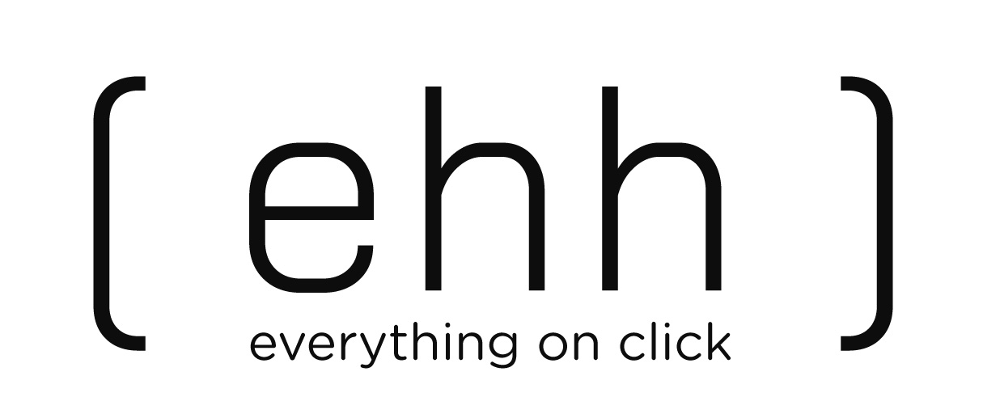

# ActionSpace

## Using ActionSpace

* For Now, as the actionSpace is in the process of development, use it by opening a directory from local file system.
* If you not open a local directory, you cannot use features like save. However, you can use new entity, export.
* For a list of resources, please check [here](./resourceGuide.md).
* For live version, you can check [here](https://bronzwikgk.github.io/actionSpace/index.html)

## Opening a directory

1. Click on `action` in the topmost menu bar.
2. Now a dropdown appears, hover at `import` , and you'll see a side dropdown.
3. In the recently opened dropdown, click on `directory`.
4. Now select a directory in the prompt, and you're all set to go.
  
## Opening a file

* Use the same above process, just click on `file`, instead of `directory` in the step 3.

## Creating an Entity

1. Click on `action` in the topmost menu bar.
2. Now a dropdown appears, hover at `create` , and you'll see a side dropdown.
3. In the recently opened dropdown, click on the type of entity you want to create.
 
## Adding a menu Item.

1. create ReqModel of the userFlow you want to add.
2. open  navbarTopUi.js from uiReqestModels folder.
3. add an entry in menu items.

### **Note:-**

1. _Opening a file will not create an entry in the `fileSysNavigation` panel for now_.
2. _when your local file system's directory is open, you 'll notice changes reflected in your local fs._
3. _For now, workflow document is for demo only, not for use._
4. _you'll Notice a document save command running after every `10 Seconds` (Autosave). However, you can save it maually too._
5. _You can export files only, for now._

## Shunya.ek

### Stop.go.think

> The best teams in the world all have one thing in common – they live and breathe their purpose and brand promise, inside and out.
> This is their ‘brand culture’. Much more than just a great company culture, a true brand culture connects your employee experience
> with your customer experience, and ensures that it’s all pointing towards your purpose as a north star – to accelerate growth, or drive change.
